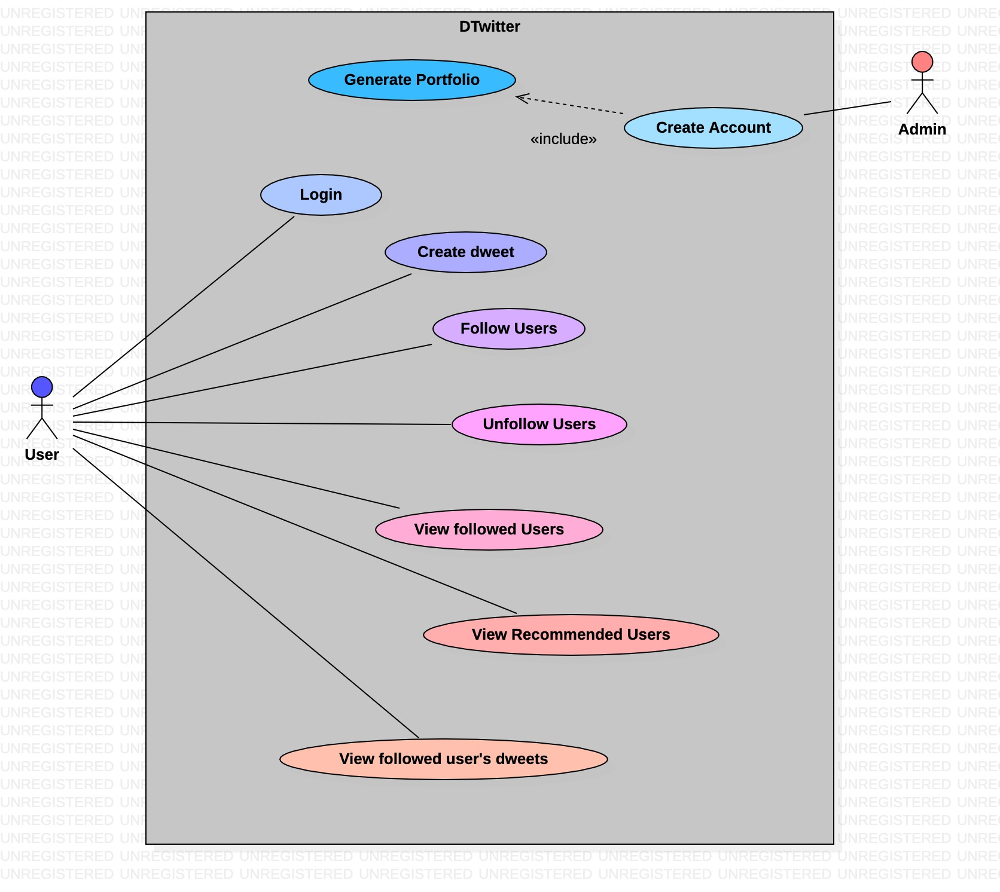
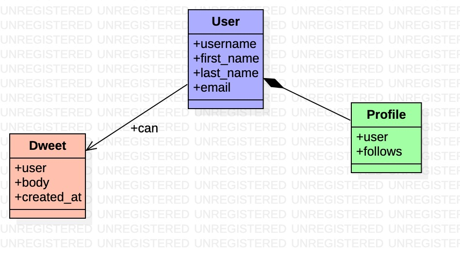

# Social Network Application - Dwitter
## Sumarry
This is a social network application called `Dwitter` which is abit similar to Twitter. This application is built for ediucational purposes. 

## Version 1
This is version one of the application. Here I will be following along with the turtorials [here](https://realpython.com/django-social-network-1/). The main aim is to lay the foundation, so we will be doing exactly like in the turtorial series. Then in the next versions, we are going to add some extra touches to make it unique.

### Key Functionalities
- User-to-User connection
- Content creation and display functionality

### User Stories
- As a **User**, I want to either follow or not follow another User so that I can view or not view their content.
- As a **User**, I want to see only the contents of the users I follow so that I can read only the contents of Users I want
- As a **User**, I want to know who exists so that I know whom I can follow
- As a **User**, I want to see all my followers so that I can know all those who follows me.
- As a **User**, I want to dweet so that those who follow me can see my dweets

### UML Diagrams
Here, I will include a few UML diagrams to better understand or communicate what we will be building in this version 
#### Use Case Diagram

#### Class Diagram

### Technologies and Concepts used
Here, I will list the technologies and concepts leveraged in order to realise this application.

#### Techology
- [Django](https://docs.djangoproject.com/en/3.2/) for backend
- [Django Template](https://docs.djangoproject.com/en/4.0/topics/templates/) for frontend
- [Bulma CSS](https://bulma.io) for styling
- [StartUML](https://staruml.io) for designing UML diagrams
- [Heroku](https://id.heroku.com/login) for hosting
- [Git/Github](https://git-scm.com) for version control
- [Virtualenv/pip](https://virtualenv.pypa.io/en/latest/cli_interface.html) for dependency management
- [isort](https://pypi.org/project/isort/) for sorting imports
- [mypy](https://mypy.readthedocs.io/en/stable/index.html) for type checking
- [pytest-django](https://pytest-django.readthedocs.io/en/latest/) for testing
- [Flake8](https://flake8.pycqa.org/en/latest/) for style guide enforcement.
- [pdb](https://docs.python.org/3/library/pdb.html)/[ipdb](https://pypi.org/project/ipdb/)/[django-debuger-tool](https://django-debug-toolbar.readthedocs.io/en/latest/) for debugging
- [VScode](https://code.visualstudio.com) for editing

#### Concepts
- [Twelve-Factor-Application](https://12factor.net) for design
- [TDD](https://en.wikipedia.org/wiki/Test-driven_development) for development
- [OOP](https://en.wikipedia.org/wiki/Object-oriented_programming) in Python3 for development